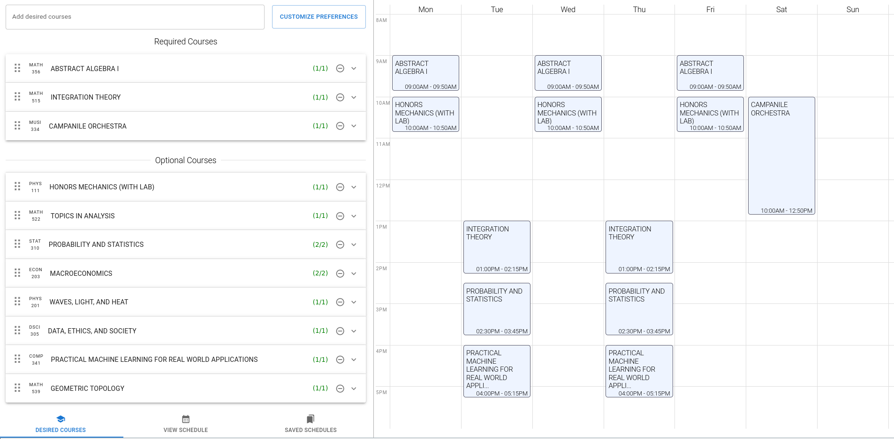

# ClassDex
By Adam, Chris, Michelg, and Valerie

Course scheduling can be difficult, especially when you're trying to schedule a large number of courses with lots of possible time slots.

Our solution is to make a course scheduler which lets you choose your courses, preferences, and priorities, and then uses a linear-algebra based algorithm to generate the optimal schedule to streamline your semester.

## Technologies

Our Frontend was made using Typescript, ReactJS, and Bootstrap. The Algorithm was created using a combination of Python and Matlab. We also used Jira and Github for project management throughout the course of the project.

## The Algorithm

Our algorithm works by recontextualizing the problem of course scheduling into a linear-algebra problem. By weighting each class section according to your preferences, such as the time of day, proximity to other classes, and how highly you ranked it in your course deck, ClassDex is able to find the list of courses which maximizes your preferences, while still staying within the credit-hour range that /you/ specify.

## The Frontend

Our frontend is centered around a React App, which allows it to perform almost everything you need with minimal communication between you and the server. The app only need to access the server when running the algorithm, making the user experience seamless at all times.

## Selecting Classes

The UI is split into two sections. On the left side, the user can browse and select from every course offered at Rice. Each course displays a myriad of information, including the description, available sections, days of the week, and instructors for each session. For instructors with a Rate My Professor page, we even use the Rate My Professor API to fetch and display their rating right on the course page.

In this view, the user can add and remove courses, reorder courses based on priority, and even select which sections of a course they might want to avoid. You can also customize preferences, such as your desired time of day, or a minimum and maximum number of credit hours, which will tweak the inputs of the algorithm to provide a better schedule for your needs.

## Viewing your Results

The right side of the UI is a calendar view which displays your entire schedule on a single page, dynamically changing size if you have any unusually early or late classes.

